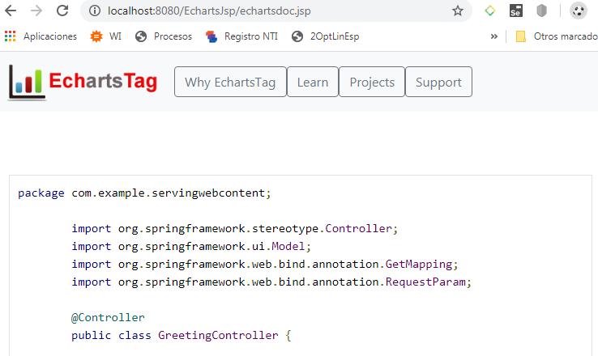
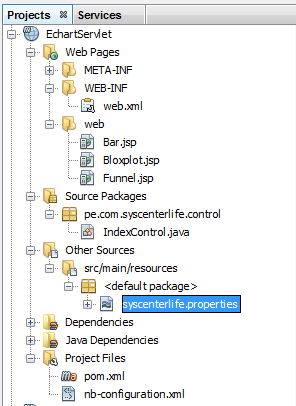
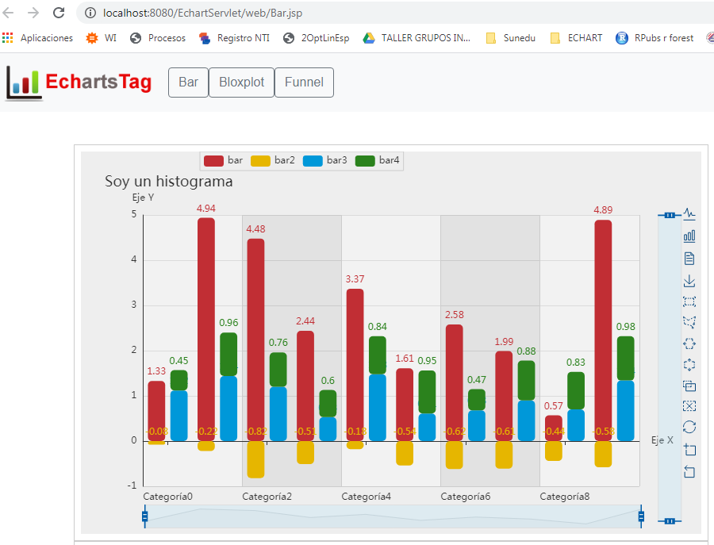
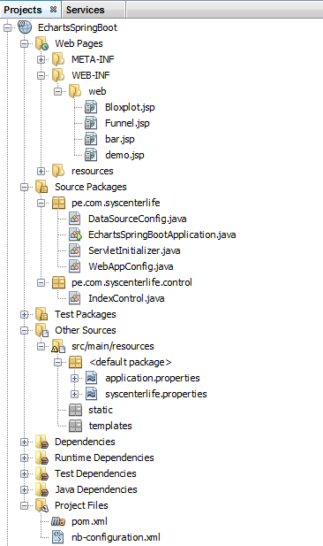
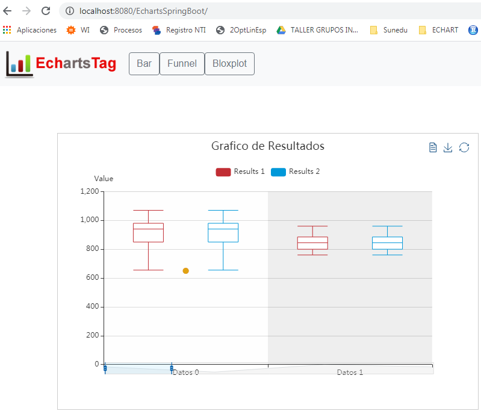
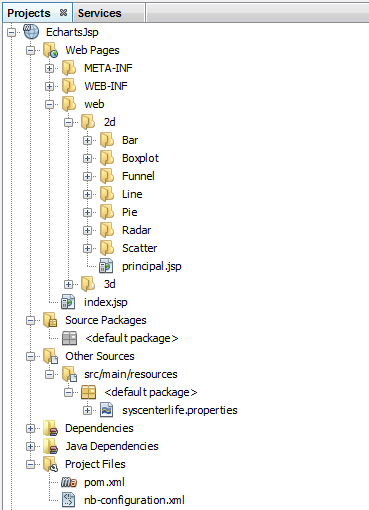
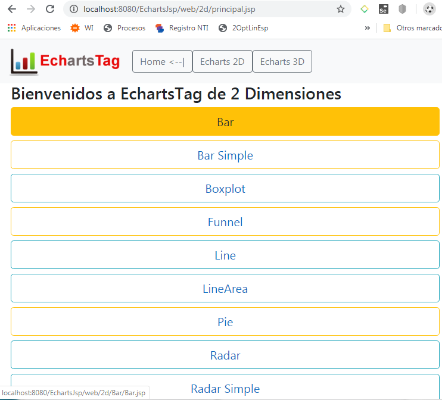
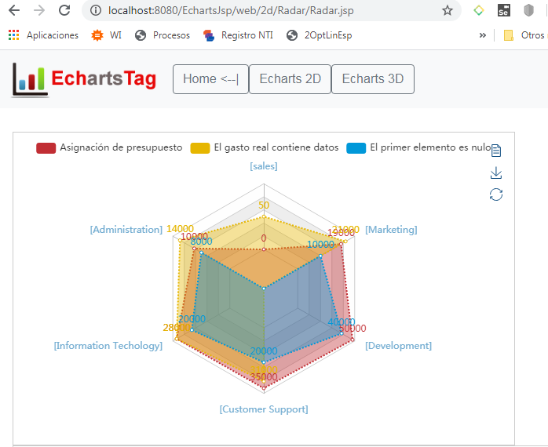
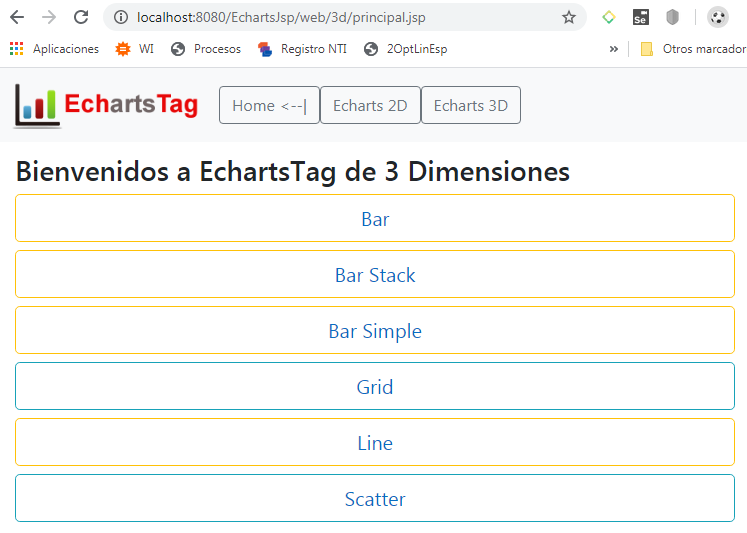

# EchartsTag
EchartsTag is a graphics project for Java, it is still in development, for any suggestion or improvement contribution you can write to me by email (mamanipari@gmail.com) or WhatsApp (951782520), I am from Peru and my official language is Spanish.


## Steps to create a project

Step 1: Development environment
1.- It works from Java v1.8 onwards
[Download Java / OpenJDK](https://jdk.java.net/14/)
2.- The most suitable development IDE is Apache NetBeans
[Download Apache NetBeans](https://netbeans.apache.org/)
3.- The most suitable server is Apache Tomcat v8 onwards
[Download Apache Tomcat 9](https://tomcat.apache.org/download-90.cgi)


Step 2: To test you can create any Maven type project in Java (for example with the name of: EchartsJsp)

Step 3: Inside the pom.xml file put the following code that refers to the repository from where the library will be downloaded.
#### pom.xml
```xml
    <repositories>
            <repository>
                <id>jitpack.io</id>
                <url>https://jitpack.io</url>
            </repository>
    </repositories>
```
Step 4: Then Add the following dependency.

```xml
	<dependency>
	    <groupId>com.github.davidmp</groupId>
	    <artifactId>EchartsTag</artifactId>
	    <version>1.4</version>
	</dependency>
```
Step 5: Inside the Java Resources folder create a properties file with the following name syscenterlife.properties and inside it place the following content:
#### syscenterlife.properties
```properties
echarts.theme.name=default
echarts.lang.name=es
```

Step 6: Run your project with a content server, preferably Tomcat version 9 onwards and place in your browser http://localhost:8080/EchartsJsp/echartsdoc.jsp and the documentation on how to use it will appear.



# Example of Projects with EchartsTag
Example of Projects with the EchartsTag Framework

##### EchartsTag con Proyectos de Tipo Maven Servlets
Project structure



Results



##### EchartsTag with Maven Spring Boot Projects
Project structure



Results



##### EchartsTag con Proyectos de Tipo Maven JSP puro
Project structure



Results






